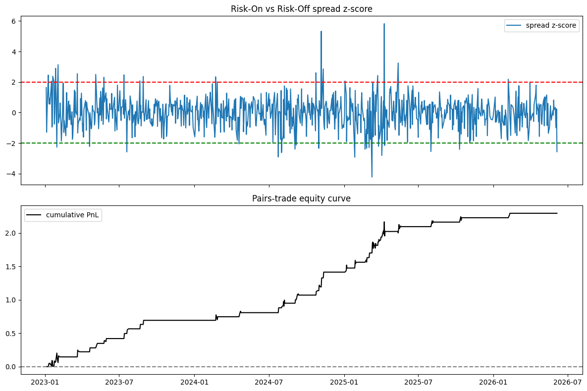
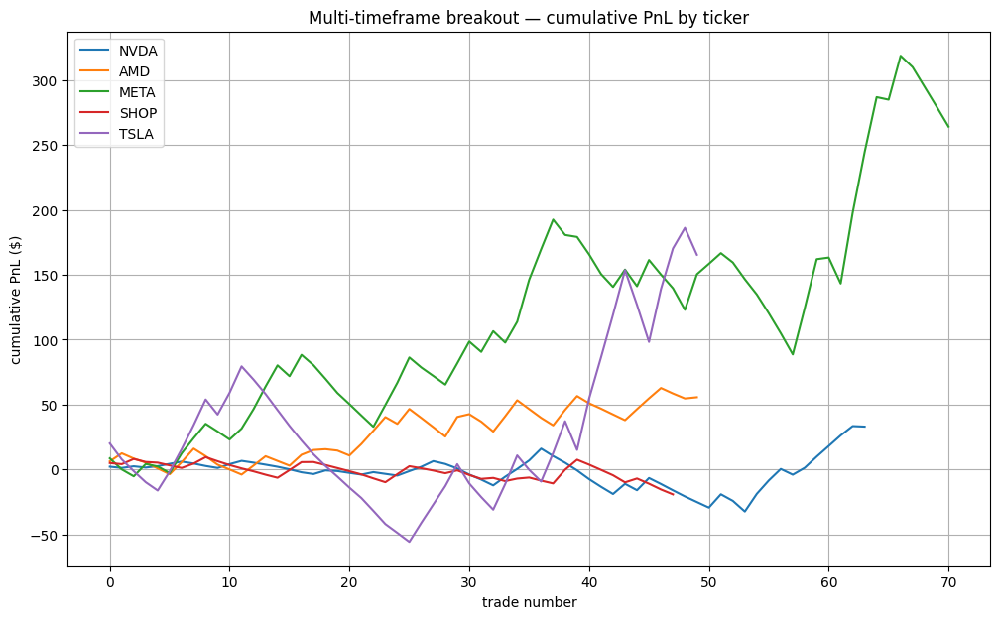

# quant-backtests

What's up nerds? Here are baby's first two exploratory trading-strategy backtests on equities and crypto, built with
`pandas` + `yfinance`:

1. **Risk-On vs Risk-Off pairs trade** — a z-score mean-reversion strategy on
   the spread between a high-beta "risk-on" basket and a defensive "risk-off"
   basket.
2. **Multi-timeframe breakout** — a trend-following breakout on high-beta stocks,
   gated by daily *and* weekly trend, with ATR-based take-profit / stop-loss.

> **Disclosure so you don't SUE ME: These are research backtests, not trading advice.** They ignore transaction
> costs, slippage, borrow fees, and survivorship bias. Treat the results as a
> study of signal behaviour, not a live edge.

## My Quant Dev Exploration Lore 

I first prototyped these strategies in a Jupyter/Colab notebook in last summer (2025), in between shifts at REI in SoHo, staring up idly at the Thrive Capital banner hanging above us on the Puck Building. Sigh. then set the project down when other things took priority, like securing housing and yadda yadda. I picked it
back up this month and used it as a refresher on quant tools, invigorated by nyctechweek 2026 so i got to cleaning the code up into
something shippable and fixing two bugs that had been breaking it.

**What's original (summer 2025):** the two strategy ideas and their logic — the
risk-on/off spread construction, the z-score entry/exit rules, the
multi-timeframe breakout with ATR brackets. That work is preserved in
`notebooks/` and carried, largely unchanged, into `src/`.

**What was added in the June 2026 revival:**
- Refactored the duplicated notebook cells into reusable modules under `src/`.
- Fixed two bugs (see below) that had stopped Part B from running at all and
  were corrupting Part A's equity curve.
- Pulled parameters out into `config.yaml`.
- Added a verification layer under [`tests/`](tests/) — clearly separated, and
  **not** part of the original notebook (see `tests/README.md`).

## Results

Run over **858 trading days** (Jan 2023 – Jun 2026 for the pairs trade; Jan 2023 – Jul 2025 for the breakout). *Past performance of a toy backtest is not indicative of anything — see the disclaimer above.*

### Part A — Risk-On vs Risk-Off pairs trade

Final cumulative PnL **+2.30** (in spread-return units). The strategy sits flat most of the time and only trades when the z-score hits ±2, so the equity curve is a series of discrete mean-reversion captures rather than a continuous ride.



### Part B — Multi-timeframe breakout

| Ticker | Trades | Win rate | Total PnL |
| --- | ---: | ---: | ---: |
| NVDA | 64 | 34% | +$33.07 |
| AMD  | 50 | 38% | +$55.71 |
| META | 71 | 34% | +$264.14 |
| SHOP | 48 | 17% | −$19.15 |
| TSLA | 50 | 38% | +$165.44 |

The interesting part: **four of five names are net-positive despite winning fewer than 40% of their trades.** That's the 2:1 ATR take-profit / stop-loss ratio at work — winners are sized to roughly double the losers, so a sub-50% hit rate still compounds upward. SHOP is the cautionary tale: at a 17% win rate, no risk/reward ratio saves you.



## The two bug fixes

- **`yfinance` MultiIndex columns (broke Part B entirely).** Modern `yfinance`
  returns two-level columns like `('Close', 'TSLA')` instead of `'Close'`, so
  every `.agg({"Open": "first", ...})` raised
  `"Column(s) ['Close', ...] do not exist"`. Fixed once in `src/data.py` by
  flattening the columns on download.
- **Pairs-trade PnL accounting (corrupted Part A's curve).** The original loop
  did `current_pnl += unrealized - current_pnl` while a position was open, which
  overwrote accumulated *realized* PnL with the latest *unrealized* value. Fixed
  in `src/pairs_trade.py` by tracking realized PnL separately and adding the open
  position's mark-to-market for the equity curve.

## Repository layout

```
quant-backtests/
├── config.yaml             # tickers, date ranges, thresholds — edit and re-run
├── run.py                  # runs both backtests from config.yaml
├── src/
│   ├── data.py             # yfinance loaders (with the MultiIndex fix)
│   ├── pairs_trade.py      # Part A: risk-on/off spread mean reversion
│   └── breakout.py         # Part B: multi-timeframe breakout
├── notebooks/
│   └── strategies.ipynb    # cleaned interactive walkthrough
├── images/                 # charts rendered for this README
├── tests/                  # verification addendum (added in the revival)
│   ├── test_strategies.py  # offline unit tests, assert exact PnL
│   └── smoke_real_data.py  # live end-to-end smoke test
├── requirements.txt
└── environment.yml
```

## Setup

Pip + venv:

```bash
python -m venv .venv
source .venv/bin/activate
pip install -r requirements.txt
```

Or conda:

```bash
conda env create -f environment.yml
conda activate quant-backtests
```

## Usage

Run both strategies with the parameters in `config.yaml`:

```bash
python run.py            # prints a summary
python run.py --plot     # also saves charts to outputs/
```

Tweak the universe, dates, or risk parameters in `config.yaml` — no code changes
needed. For an interactive walkthrough with plots, open
`notebooks/strategies.ipynb`.

## Tests

```bash
pytest tests/test_strategies.py -v     # fast, offline, asserts exact numbers
python tests/smoke_real_data.py        # live run against Yahoo Finance
```

## Caveats

- **Data:** Yahoo Finance rate-limits (HTTP 429) under heavy use, and only
  serves intraday (e.g. 60-minute) bars for roughly the trailing 730 days.
- **Not investable as-is:** no costs, slippage, or position sizing are modelled.
- **Lookahead bias in the z-score:** `zscore()` standardises the spread against
  its *full-sample* mean and standard deviation, so each day's score implicitly
  "sees" future data. This inflates the pairs-trade results. A live version would
  use a rolling or expanding window that only uses information available at the
  time. Kept as-is here to stay faithful to the original notebook.

- HIRE MEEEEEEE
